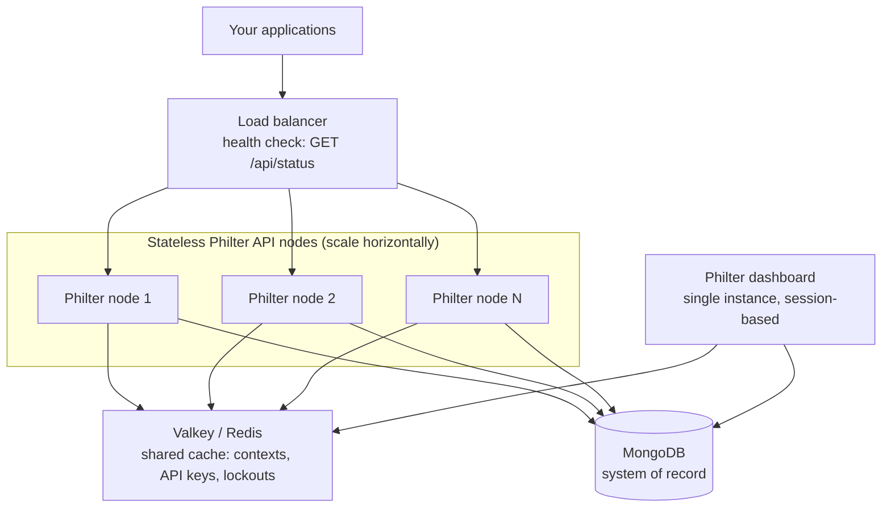

# High Availability and Clustering

Philter scales horizontally as a pool of stateless API nodes behind a load balancer, all sharing one cache and one database. High availability is a matter of topology and configuration, not special clustering code: you run more than one Philter instance, point them at a shared [Valkey/Redis cache](caching.md) and the same [MongoDB](database.md), and put a load balancer in front.

## Topology



A load balancer distributes API requests across two or more identical, stateless Philter nodes. Every node reads and writes the same shared Valkey/Redis cache and the same MongoDB, so any node can serve any request and they all produce consistent results. The dashboard is the one exception: it is session-based and runs as a single instance (see below).

## What is stateless and what is shared

- **Philter API nodes are stateless.** Each API request (`/api/**`) is authenticated from its own API key and depends on no server-side session, so any node can serve any request. Add or remove nodes freely.
- **MongoDB is the system of record.** Policies, API keys, contexts and their token-to-replacement mappings, ledgers, and more live in [MongoDB](database.md). Philter does not start without it.
- **Valkey/Redis is the shared cache.** Context replacements, the API-key cache, and login-lockout counters are shared through [Valkey/Redis](caching.md) so they stay consistent across the fleet.
- **The dashboard is single-instance.** The dashboard is session-based; its server-side session is not shared, so it runs as one instance and is not part of the scaled API tier. It is a low-traffic admin console, not the redaction hot path. See [Caching](caching.md#horizontal-scaling-the-api-not-the-dashboard) and [Login Security](login_security.md).

## Required configuration

Every node must share the same backing services:

- **Same cache.** Set `CACHE_HOSTNAME` (and `CACHE_PORT`, `CACHE_PASSWORD`, `CACHE_SSL` as needed) identically on every node so they share one Valkey/Redis. With more than one node this is effectively required, not optional: without it, each node keeps its own in-process cache, replacements become inconsistent, and login lockout becomes evadable. The full configuration table is in [Caching](caching.md#configuration).
- **Same database.** Point every node at the same MongoDB. See [Database](database.md).
- **Same policies.** Because policies live in MongoDB, every node sees the same policies automatically once they share the database.

## Load balancing

Put any HTTP load balancer in front of the API nodes. Requests are stateless, so no sticky sessions are needed for `/api/**`. Configure the load balancer health check against Philter's status endpoint:

```
GET /api/status
```

The [status endpoint](api_and_sdks/api/filtering_api.md#status) is intended for exactly this: monitoring tools and load-balancer health checks. Route a node out of service when it stops returning a healthy status. If you also expose the dashboard through the load balancer, send it to the single dashboard instance rather than the API pool, since it is session-based.

## Horizontal scaling

- **Add a node.** Deploy another identical Philter instance with the same `CACHE_HOSTNAME`, database, and configuration, and register it with the load balancer. No data migration or rebalancing is needed, because the node holds no durable state of its own.
- **Remove a node.** Drain it at the load balancer and stop it. In-flight requests on a removed node should be retried by the client.
- **Sizing.** Redaction throughput is CPU-bound, especially when policies use the name-detection (NER) filters. Size each node for your per-node request rate and scale the node count for total throughput; see [System Requirements](system_requirements.md). Size the shared cache and database for the aggregate load of the whole fleet rather than per node.
- **Model serving.** When policies use NER filters served by [PhEye](https://philterd.github.io/ph-eye/), PhEye is a separate scaling axis: Philter calls it for those filters, so scale PhEye alongside Philter for name-heavy workloads.

## Node failover

Because the nodes are stateless and share the cache and database, losing one does not break redaction:

- The load balancer stops routing to a node once its `/api/status` health check fails, and sends new requests to the remaining healthy nodes.
- Requests in flight on the lost node fail and should be retried; the retry is served by another node.
- Consistent pseudonymization is preserved across the failover. Replacements are written to the shared cache and persisted in MongoDB, so a surviving node produces the same replacement for the same input value. No per-node state is lost that would change redaction output.

Make the shared services highly available too. Philter's own availability depends on the cache and database it shares, so run **Valkey/Redis** and **MongoDB** in their own highly-available configurations (for example, a replica set for MongoDB and a replicated or clustered Valkey deployment). A single-node cache or database is the real single point of failure in an otherwise horizontally-scaled Philter deployment.

## Related

- [Caching](caching.md): the shared cache backend and its configuration.
- [Database](database.md): what Philter persists in MongoDB.
- [Referential Integrity](other_features/referential_integrity.md): how consistent replacements work.
- [System Requirements](system_requirements.md): per-node sizing.
