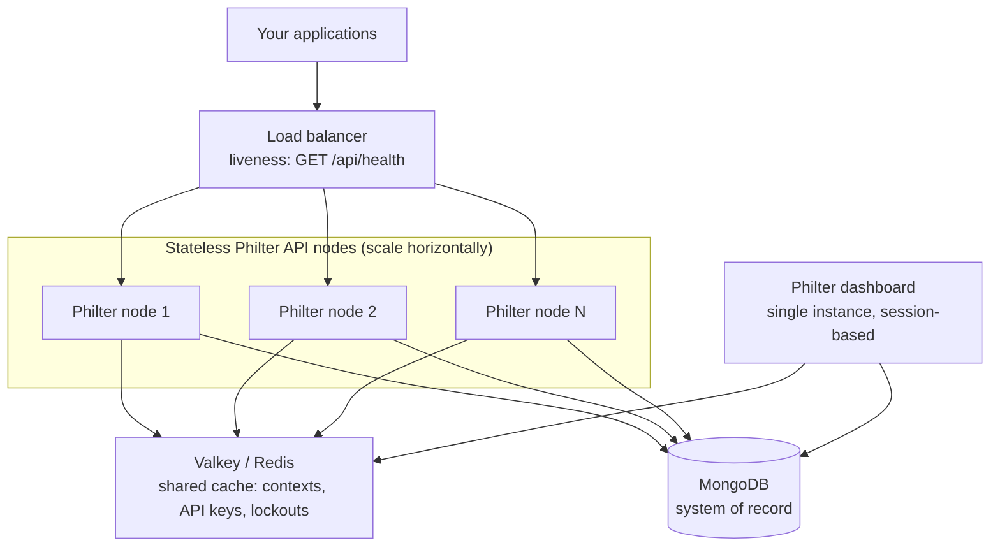

# High Availability and Clustering

Philter scales horizontally as a pool of stateless API nodes behind a load balancer, all sharing one cache and one database. High availability is a matter of topology and configuration, not special clustering code: you run more than one Philter instance, point them at a shared [Valkey/Redis cache](caching.md) and the same [MongoDB](database.md), and put a load balancer in front.

## Topology


```mermaid
flowchart TB
  clients["Your applications"]
  lb["Load balancer<br/>liveness: GET /api/health"]
  subgraph api["Stateless Philter API nodes (scale horizontally)"]
    p1["Philter node 1"]
    p2["Philter node 2"]
    p3["Philter node N"]
  end
  cache["Valkey / Redis<br/>shared cache: contexts, API keys, lockouts"]
  db[("MongoDB<br/>system of record")]
  dash["Philter dashboard<br/>single instance, session-based"]

  clients --> lb
  lb --> p1
  lb --> p2
  lb --> p3
  p1 --> cache
  p2 --> cache
  p3 --> cache
  p1 --> db
  p2 --> db
  p3 --> db
  dash --> db
  dash --> cache
```

A load balancer distributes API requests across two or more identical, stateless Philter nodes. Every node reads and writes the same shared Valkey/Redis cache and the same MongoDB, so API requests can be served by any node. Consistent context replacements depend on retained MongoDB mappings and cache invalidation, as described below. The dashboard is the one exception: it is session-based and runs as a single instance (see below).

## What is stateless and what is shared

- **Philter API nodes are stateless.** Each API request (`/api/**`) is authenticated from its own API key and depends on no server-side session, so any node can serve any request. Add or remove nodes freely.
- **MongoDB is the system of record.** Policies, API keys, contexts and their token-to-replacement mappings, ledgers, and more live in [MongoDB](database.md). Philter does not start without it.
- **Valkey/Redis is the shared cache.** Context replacements, the API-key cache, and login-lockout counters are shared through [Valkey/Redis](caching.md) so they stay consistent across the fleet.
- **The dashboard is single-instance.** The dashboard is session-based; its server-side session is not shared, so it runs as one instance and is not part of the scaled API tier. It is a low-traffic admin console, not the redaction hot path. See [Caching](caching.md#horizontal-scaling-the-api-not-the-dashboard) and [Login Security](login_security.md).

## Required configuration

Every node must share the same backing services:

- **Same cache.** Set `CACHE_HOSTNAME` (and `CACHE_PORT`, `CACHE_PASSWORD`, `CACHE_SSL` as needed) identically on every node so they share one Valkey/Redis. With more than one node this is effectively required, not optional: without it, each node keeps its own in-process cache, invalidations do not reach the other nodes, and login-lockout counters are not shared. MongoDB still coordinates creation of new token mappings. The full configuration table is in [Caching](caching.md#configuration).
- **Same database.** Point every node at the same MongoDB. See [Database](database.md).
- **Same encryption key.** Set the same `PHILTER_ENCRYPTION_KEY` on every node. It is required to decrypt shared records and derive consistent keyed token hashes. Preserve it across restarts; see [Encryption](settings.md#encryption).
- **Same queue limits.** Use identical [async admission limits](settings.md#async-queue-admission) on every node.
- **Same policies.** Because policies live in MongoDB, every node sees the same policies automatically once they share the database.

## Load balancing

Put any HTTP load balancer in front of the API nodes. Requests are stateless, so no sticky sessions are needed for `/api/**`. Configure the load balancer health check against Philter's health endpoint:

```
GET /api/health
```

The [health endpoint](api_and_sdks/api/public_api.md) is a liveness check: it returns `200` with `"status": "UP"` when its handler can respond. It does not probe MongoDB, the cache, or worker progress. Remove unresponsive nodes from routing, but also monitor dependency availability, queue age, and processing failures before deciding a node can accept useful work. Philter does not expose a dedicated dependency-readiness endpoint through `/api/health`.

If you also expose the dashboard through the load balancer, send it to the single dashboard instance rather than the API pool, since it is session-based.

The Docker image serves HTTPS with a self-signed certificate by default, which a load balancer will not trust. Hold the real certificate at the load balancer and set `SSL_ENABLED=false` on every node so they serve plain HTTP behind it, over a private network. See [TLS](settings.md#tls).

## Horizontal scaling

- **Add a node.** Deploy another identical Philter instance with the same `CACHE_HOSTNAME`, database, and configuration, and register it with the load balancer. No data migration or rebalancing is needed, because the node holds no durable state of its own.
- **Remove a node.** Drain it at the load balancer and stop it. Account for in-flight requests and background jobs before stopping it; see the ambiguous-outcome guidance below.
- **Sizing.** Redaction throughput is CPU-bound, especially when policies use the name-detection (NER) filters. Size each node for your per-node request rate and scale the node count for total throughput; see [System Requirements](system_requirements.md). Size the shared cache and database for the aggregate load of the whole fleet rather than per node.
- **Model serving.** When policies use NER filters served by [PhEye](https://philterd.github.io/ph-eye/), PhEye is a separate scaling axis: Philter calls it for those filters, so scale PhEye alongside Philter for name-heavy workloads.

## Node failover

Shared state allows surviving nodes to continue processing, subject to dependency availability and recovery:

- The load balancer stops routing to a node once its `/api/health` health check fails, and sends new requests to the remaining healthy nodes.
- A lost connection leaves the outcome of an in-flight request uncertain. An async job may have been stored even if its acceptance response was lost; replaying the request can create another job. Philter has no general request idempotency key. If you received a document ID, check its status through the [Documents API](api_and_sdks/api/documents_api.md) before resubmitting.
- For context-scoped replacement, MongoDB atomically establishes mappings and supplies them on cache misses. Surviving nodes reuse retained mappings when keys, configuration, and invalidation are consistent. Eviction at `MAX_CONTEXT_SIZE`, explicit deletion or overwrite, and stale per-node caches can change that behavior; see [Referential Integrity](other_features/referential_integrity.md).
- For explicit quota or contention rejections (429/503), honor `Retry-After: 5` and use backoff. Persistent 503 may indicate an uncertain admission whose guard requires operator recovery. Follow the [admission recovery procedure](settings.md#async-queue-admission); do not clear the guard while any writer or database operation can still complete.

Make the shared services highly available too. Philter's own availability depends on the cache and database it shares, so run **Valkey/Redis** and **MongoDB** in their own highly-available configurations (for example, a replica set for MongoDB and a replicated or clustered Valkey deployment). A single-node cache or database is the real single point of failure in an otherwise horizontally-scaled Philter deployment.

## Related

- [Caching](caching.md): the shared cache backend and its configuration.
- [Database](database.md): what Philter persists in MongoDB.
- [Referential Integrity](other_features/referential_integrity.md): how consistent replacements work.
- [System Requirements](system_requirements.md): per-node sizing.
