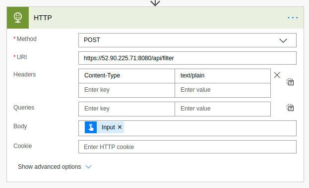

# Using Philter with Microsoft Power Automate (Flow)

[Microsoft Power Automate](https://flow.microsoft.com/en-us/) (formerly Microsoft Flow) is an online application to automate tasks using an intuitive online editor. Using the tool you can create automations that are triggered by events, such as the receiving of an email or a new file being stored in OneDrive. In this example solution we will create a trivial automation that uses Philter to filter sensitive information from text.

We will use an HTTP step to make the call to Philter. An upstream action is setting the content of `Input` that we are putting into the body of the message. The `Input` is plain text so we add an HTTP `Content-Type` header with the value of `text/plain`. In our example, the value of `Input` will be "George Washington was president and his SSN was 123-45-6789." Be sure to replace the IP address in the URI with the IP address or hostname of your Philter instance.

We are now ready to run our flow. We can do so by clicking the `Run` button. You can now switch to the `Runs` view to see the run.

Clicking on our run we can see the results of the HTTP step.

In the screen capture above, we can see a summary of the HTTP step run. We see the body of the message that was sent to Philter. At the bottom we can see the filtered text that was returned by Philter.

Integrating Philter with Microsoft Power Automate is a fairly trivial exercise thanks to Philter's API. Although this example was trivial, it should show the potential possibilities for using Philter with Microsoft Power Automate.

